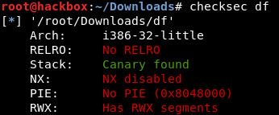
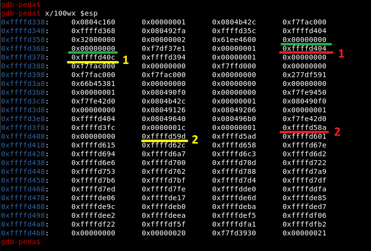

# Heap-Heap-Hooray 1000 pts



В этом теске нам дан бинарник и либси. В самом бинарнике в функции **list_chunks_content** находится **format string** уязвимость. Но поскольку наш буфер алоцирован в куче, а не на стеке, мы не можем использовать его для записи в любое место памяти. Для этого нужно использовать стековые значения.

 

Решение:



Т.к. мы можем записывать в любую стековую переменную, для получения возможности произвольной записи в памяти, нужно чтобы на стеке лежал нужный для записи адрес. Для этого необходимо, чтобы 2ая-желтая указывала на адрес свободной ячейки на стеке, а 2ая-красная - на адрес свободной ячейки на стеке **+ 2**. Теперь, записывая шортовое значение в 2ую-желтую и 2ую-красную, мы формируем произвольный адрес на стеке, после чего, записывая в эту ячейку, мы получаем возможность произвольной записи.

Так же со стека достаем адрес **libc**, т.к. либси дана, легко получаем ее **base address**, адрес **system** и адрес **""/bin/sh"**.

Далее находим регион памяти с **write** и **execute** права и записываем туда шелл код:

```assembly
push 0x00000000
push 0x00000000
push &"/bin/sh"
push dummy_return
push &system
ret
```

После чего перезаписываем **exit** в **GOT** адресом нашего шелл кода и при выходе, получаем шелл :)

```sh
$ ls
chall
df
flag.txt
glibc2.27x86
$ uname -a
Linux 2a35e26e393f 4.15.0-72-generic #81-Ubuntu SMP Tue Nov 26 12:20:02 UTC 2019 x86_64 x86_64 x86_64 GNU/Linux
$  
```

