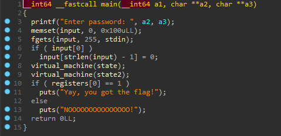
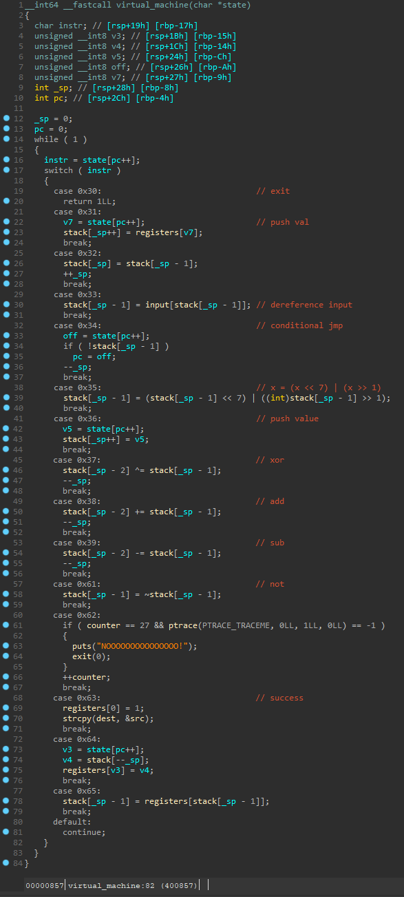

### Discount VMProtect


The name speaks for itself. We are dealing with virtual machine :)

``` bash
file chall
chall: ELF 64-bit LSB executable, x86-64, version 1 (SYSV), dynamically linked, interpreter /lib64/ld-linux-x86-64.so.2, for GNU/Linux 3.2.0, BuildID[sha1]=230e9f987b798e57f5c25421983e3545c715f850, stripped
```

entry:



This is very simple stack based virtual machine. Here its code:



Now we have to write our disassembler and reverse engineer the key check algorithm :)

disassembler:

``` python
def disassemble_vm(state):
    i = 0
    while True:
        if i == len(state):
            break
        ins = state[i]
        i += 1
        if ins == 0x30:
            print(f'{str(i-1).ljust(10)}exit')
        elif ins == 0x31:
            print(f'{str(i-1).ljust(10)}push registers[{state[i]}]')
            i += 1
        elif ins == 0x32:
            print(f'{str(i-1).ljust(10)}push stack[sp]')
        elif ins == 0x33:
            print(f'{str(i-1).ljust(10)}mov stack[sp], input[stack[sp]]')
        elif ins == 0x34:
            print(f'{str(i-1).ljust(10)}if stack[sp] == 0:')
            print(f'{str(i-1).ljust(10)}\t\tjmp {state[i]}\t; {hex(state[state[i]])}')
            print(f'{str(i-1).ljust(10)}sub sp, 1')
            i += 1
        elif ins == 0x35:
            print(f'{str(i-1).ljust(10)}stack[sp] = (stack[sp] << 7) | (stack[sp] >> 1)')
        elif ins == 0x36:
            print(f'{str(i-1).ljust(10)}push {state[i]}')
            i += 1
        elif ins == 0x37:
            print(f'{str(i-1).ljust(10)}stack[sp-1] ^= stack[sp]')
            print(f'{str(i-1).ljust(10)}sub sp, 1')
        elif ins == 0x38:
            print(f'{str(i-1).ljust(10)}stack[sp-1] += stack[sp]')
            print(f'{str(i-1).ljust(10)}sub sp, 1')
        elif ins == 0x39:
            print(f'{str(i-1).ljust(10)}stack[sp-1] -= stack[sp]')
            print(f'{str(i-1).ljust(10)}sub sp, 1')
        elif ins == 0x61:
            print(f'{str(i-1).ljust(10)}stack[sp-1] = ~stack[sp]')
            print(f'{str(i-1).ljust(10)}sub sp, 1')
        elif ins == 0x62:
            print(f'{str(i-1).ljust(10)}check antidebug')
        elif ins == 0x63:
            print(f'{str(i-1).ljust(10)}registers[0] = 1')
            print(f'{str(i-1).ljust(10)}strcpy(dest, &src)')
        elif ins == 0x64:
            print(f'{str(i-1).ljust(10)}registers[{state[i]}] = stack[sp]')
            print(f'{str(i-1).ljust(10)}sub sp, 1')
            i += 1
        elif ins == 0x65:
            print(f'{str(i-1).ljust(10)}stack[sp] = registers[stack[sp]]')
        else:
            continue
```


First bytecode:

``` python
0         push registers[128]
2         registers[0] = 1
2         strcpy(dest, &src)

3         push stack[sp]
4         push stack[sp]
5         registers[128] = stack[sp]
5         sub sp, 1
7         mov stack[sp], input[stack[sp]]
8         if stack[sp] == 0:
8         		jmp 18	; 0x36
8         sub sp, 1

10        push 1
12        stack[sp-1] += stack[sp]
12        sub sp, 1
13        push stack[sp]
14        push stack[sp]
15        stack[sp-1] -= stack[sp]
15        sub sp, 1
16        if stack[sp] == 0:
16        		jmp 3	; 0x32
16        sub sp, 1

18        push 35
20        stack[sp-1] -= stack[sp]
20        sub sp, 1
21        if stack[sp] == 0:
21        		jmp 27	; 0x36
21        sub sp, 1
23        push 0
25        registers[0] = stack[sp]
25        sub sp, 1


27        push 0
29        registers[128] = stack[sp]
29        sub sp, 1
31        exit
```

Its python representation:

``` python
def check_password_len(password):
	if len(password) != 35:
        register[0] = 0
```

Second bytecode:

``` python
0         push registers[128]
2         push stack[sp]
3         push stack[sp]
4         registers[128] = stack[sp]
4         sub sp, 1
6         mov stack[sp], input[stack[sp]]
7         push stack[sp]
8         if stack[sp] == 0:
8         		jmp 40	; 0x30
8         sub sp, 1

10        stack[sp] = (stack[sp] << 7) | (stack[sp] >> 1)
11        push 99
13        stack[sp-1] ^= stack[sp]
13        sub sp, 1
14        push 152
16        stack[sp-1] += stack[sp]
16        sub sp, 1
17        stack[sp-1] = ~stack[sp]
17        sub sp, 1
18        check antidebug
19        push registers[128]
21        push 10
23        stack[sp-1] += stack[sp]
23        sub sp, 1
24        stack[sp] = registers[stack[sp]]
25        stack[sp-1] -= stack[sp]
25        sub sp, 1
26        if stack[sp] == 0:
26        		jmp 32	; 0x36
26        sub sp, 1
28        push 0
30        registers[0] = stack[sp]
30        sub sp, 1


32        push 1
34        stack[sp-1] += stack[sp]
34        sub sp, 1
35        push stack[sp]
36        push stack[sp]
37        stack[sp-1] ^= stack[sp]
37        sub sp, 1
38        if stack[sp] == 0:
38        		jmp 2	; 0x32
38        sub sp, 1
40        exit
```

Its python representation:

``` c++
def check_password(password):
    check = 0
    for i in range(35):
		t = password[i]
        t = (t << 7) | (t >> 1)
        t &= 0xff
        t ^= 99
        t += 152
        t &= 0xff
        t = ~t
        if t != key[i]:
            check = 1
            break

    if check == 0:
        registers[0] = 1
    else:
        registers[0] = 0
```


Solution:

``` python
key = [
24, 114, 162, 164, 157, 137, 31, 162, 141, 155, 148, 13, 109, 155, 149,
236, 236, 18, 155, 148, 35, 22, 155, 108, 19, 14, 109, 13, 150, 141, 14, 144,
19, 151, 138]

def encode(t):
    t = (t << 7) | (t >> 1)
    t &= 0xff
    t ^= 99
    t += 152
    t &= 0xff
    t = ~t
    return t & 0xff

y = ""
for j in range(len(key)):
    for i in range(48, 126):    # Bruteforce every printable character
        if encode(i) == key[j]:
            y += chr(i)
print(y)
```

```
>>> XMAS{VMs_ar3_c00l_aNd_1nt3resting}
```
