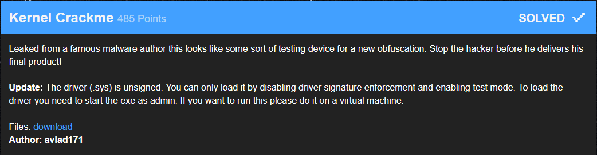
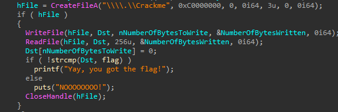
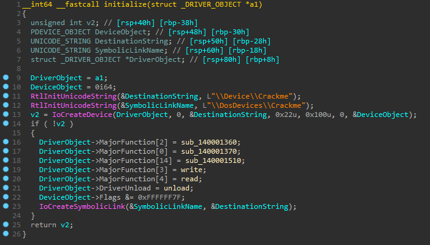
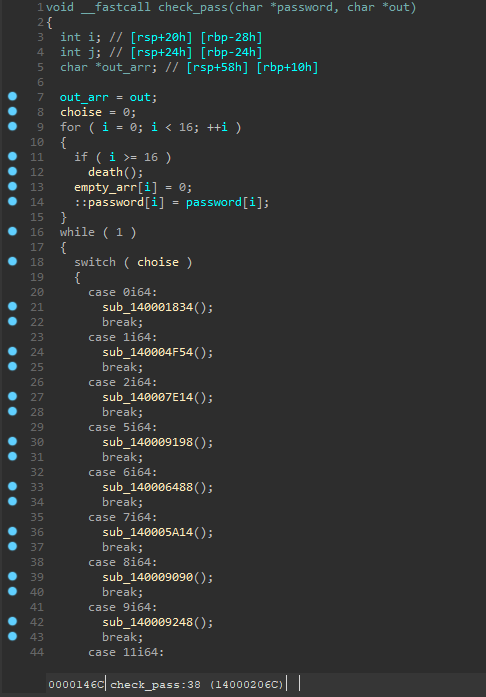
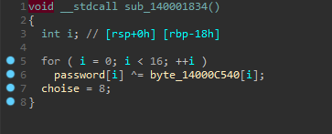
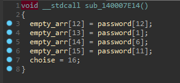
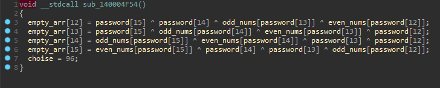
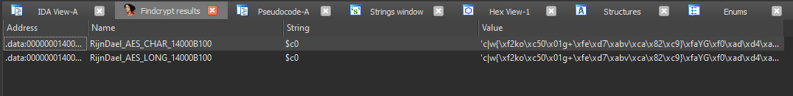
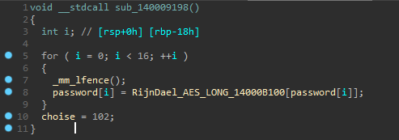
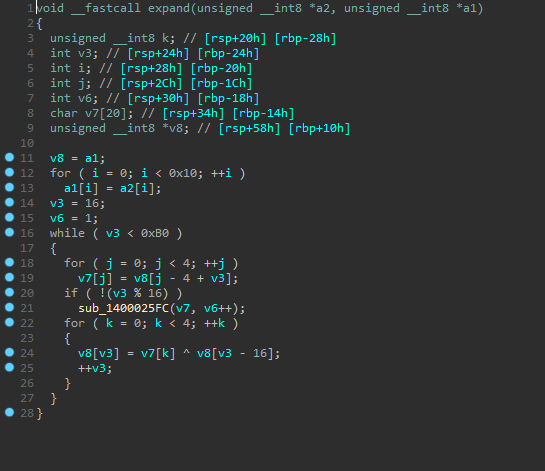

### Kernel Crackme



We are given with  **X-MAS_kernel_crackme.sys** driver and  **challenge.exe** client.

Client code:




Let's look at the driver code:

​	

We are interested in read and write major functions. **write** copies usermode buffer into driver's buffer. **read** does input processing and returns buffer to user.



This switch has 130 cases. Every case function changes **choise** variable.

Here is example of some case functions:







IDA has very useful plugin called **findcrypt** that scans binary for known crypto signatures. This time findcrypt found **AES RijnDael** constants.



We also find that this constants are used in some functions in that giant switch case statement:



So we can assume that we are dealing with obfuscated AES implementation. Looking closely at **read** major function we can see **aes expand key** function and the key, that is passed to it.



Solution:

``` python
from Crypto.Cipher import AES
from binascii import unhexlify
key = '4B 61 50 64 53 67 56 6B  58 70 32 73 35 76 38 79'.replace(' ', '')
flag = 'F2 63 69 4F F5 CB FB F4  98 19 C2 FD 39 ED F9 CC 5D EC D9 EC 66 A5 30 D1  82 46 7D A9 FD 5B 3C BF 1C 3D BD 70 26 00 6A 43  C4 0A 47 4C B7 56 2D 50 00 00 00 00 00 00 00 00  00 00 00 00 00 00 00 00'.replace(' ', '') # from client

aes = AES.new(unhexlify(key), AES.MODE_ECB)
flag = aes.decrypt(unhexlify(flag))
print flag
```

``` python
>>> 'X-MAS{060b192f0063cc9ab6361c2329687506f50321d8}\x00Nj\xfc;=TUj\x8c\xe7\x1bYZ+\xb1'
```


