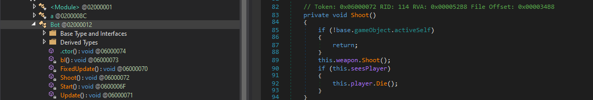

X-MAS: Lapland Mission

 

The game is written in Unity Engine. We asked to kill all robots to get the flag, but robots instantly kill us when get in their FOV.

Solution:

In Unity, every game class is stored in "Data\Managed\Assembly-CSharp.dll". Let's open it in dnSpy.

Let's open Bot class and change Shoot method for this:

To this:

Now bots can't kill us and we can easily get the flag:)

