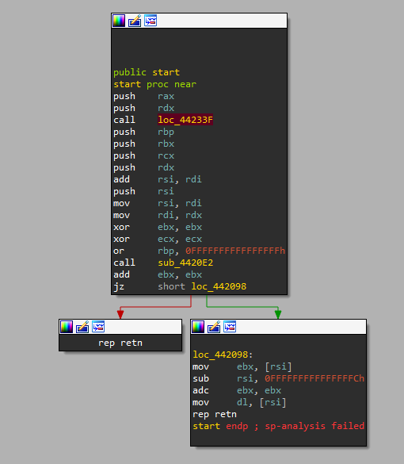
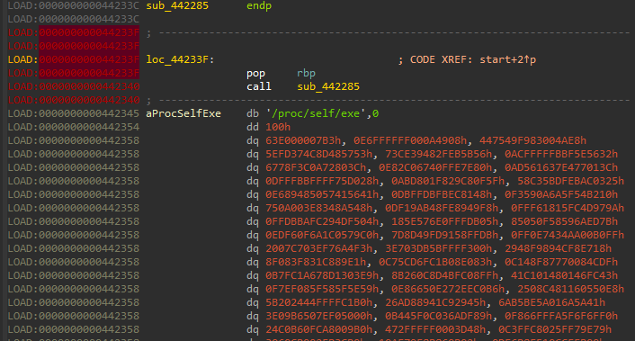
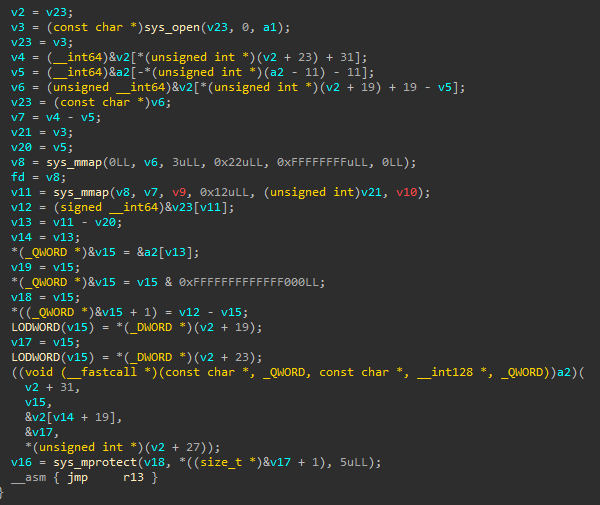
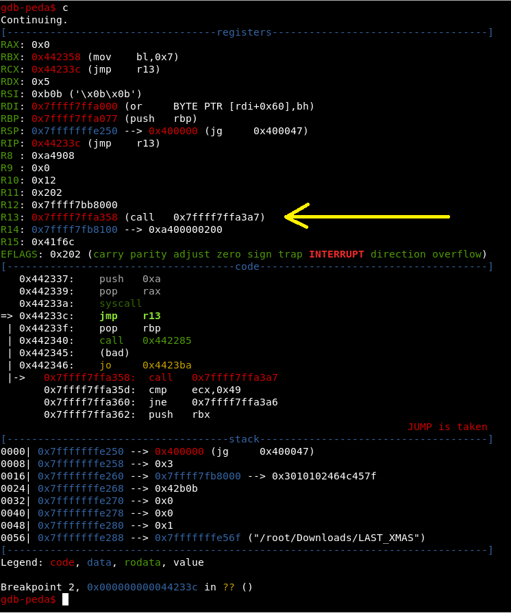
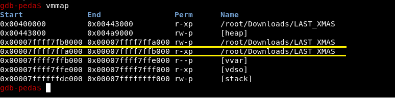
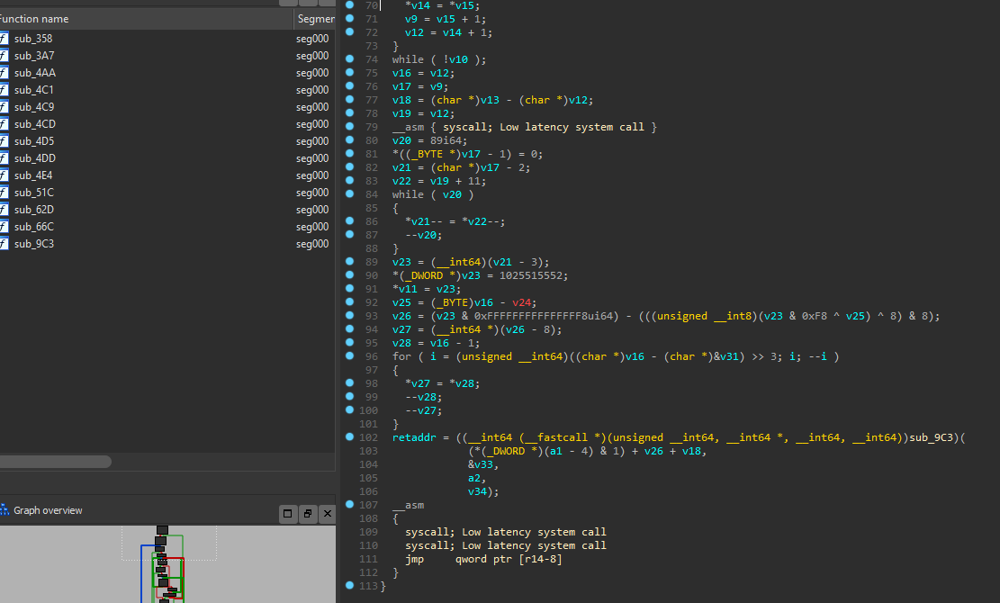
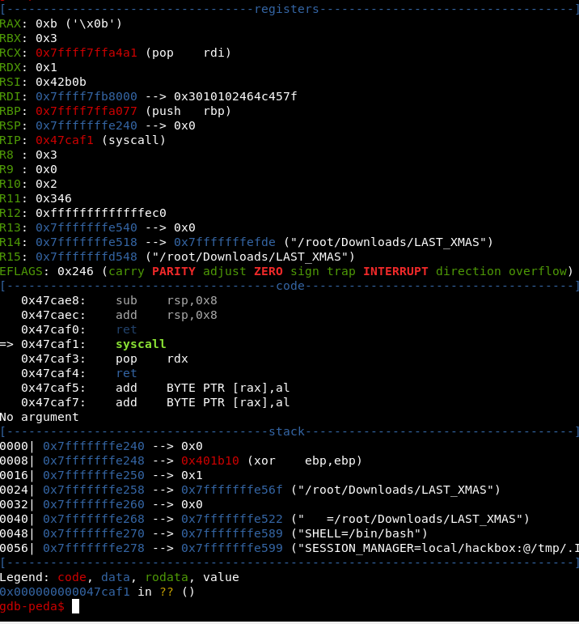
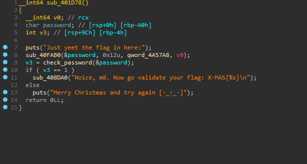
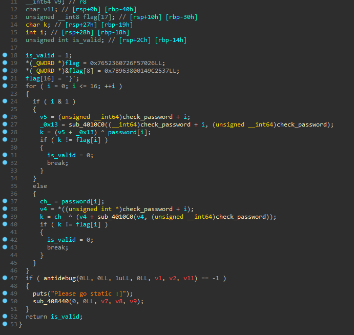

### Last Christmas


``` bash
root@box:~# file LAST_XMAS 
LAST_XMAS: ELF 64-bit LSB executable, x86-64, version 1 (GNU/Linux), statically linked, no section header

```

Before we analyze the algorithm we have to unpack the binary. If you look into it in IDA, you might notice that the first function allocates memory, decrypts it and jumps to it via register.







Let's set breakpoint on **jmp r13** and see there it leads up.





As we can see **r13** is pointing to newly created 1kb memory region. Let's dump it and open in IDA.

``` bash	
gdb-peda$ dumpmem shellcode 0x00007ffff7ffa000 0x00007ffff7ffb000
Dumped 4096 bytes to 'shellcode'
```



Looks like another layer of decryption. Let's set bp on **jmp qword ptr [r14-8]** and follow it.



Aaaaand we are back to the image memory region. Now let's dump the image and see what has changed.

``` bash
gdb-peda$ vmmap
Start              End                Perm	Name
0x00400000         0x00401000         r--p	mapped
0x00401000         0x0047d000         r-xp	mapped
0x0047d000         0x004a1000         r--p	mapped
0x004a1000         0x004a2000         ---p	mapped
0x004a2000         0x004a9000         rw-p	[heap]
0x00007ffff7fb7000 0x00007ffff7fb8000 r--p	/root/Downloads/LAST_XMAS
0x00007ffff7fb8000 0x00007ffff7ffa000 rw-p	/root/Downloads/LAST_XMAS
0x00007ffff7ffa000 0x00007ffff7ffb000 r-xp	/root/Downloads/LAST_XMAS
0x00007ffff7ffb000 0x00007ffff7ffe000 r--p	[vvar]
0x00007ffff7ffe000 0x00007ffff7fff000 r-xp	[vdso]
0x00007ffffffde000 0x00007ffffffff000 rw-p	[stack]
gdb-peda$ dumpmem unpacked mapped
Dumped 663552 bytes to 'unpacked'
```

Looks like the binary is unpacked.



Now let's see the actual algorithm:



So, what is going on here? We can already notice the flag length - 17 chars. Also the **flag** itself. I have to say that **sub_4010c0** is massive BUT it always returns **0x13**.

Solution:

``` python
data = [0x55, 0x41, 0x83, 0x89, 0x45, 0x00, 0x26, # actual bytes of the function
0x07, 0x48, 0x9C, 0x96, 0x45, 0x55, 0xE05,
0xE8, 0x00, 0x00, 0xE8, 0x85, 0x8B, 0x63,
0x45, 0xD0, 0x41B, 0x45, 0x485, 0x00]
base = 0x401c2d	# function address

flag = [0x26,0x70,0xF5,0x26,0x07,0x36,0x52,0x76,0x37,0x25,0x9C,0x14,0x00,0x38,0x96,0x7B,125]

ans = ""
for i in range(0, 17, 1):
    if i & 1:
        ans += chr(((base + i + 0x13) & 0xff) ^ flag[i])
    else:
        ans += chr(((test[i] + 0x13) & 0xff) ^ flag[i])

print(ans)
```

``` 
>>> N1ce_sk1ll5_hum4n
```

:)


