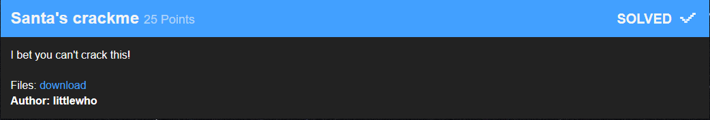
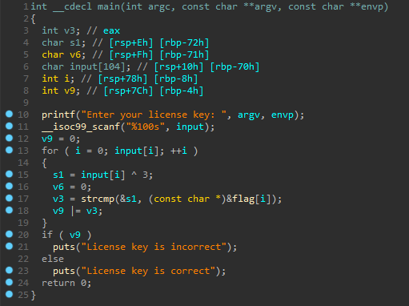
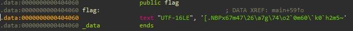

### Santa's Crackme



The first and the most easiest crackme. The input is xored with 3 and compared with encoded flag.







Solution:

``` python
flag = '[.NBPx67m47\\26\\a7g\\74\\o2`0m60\\`k0`h2m5~'
password = ''
for i in flag:
    password += chr(ord(i) ^ 3)
print password
```

```python 
>>> X-MAS{54n74_15_b4d_47_l1c3n53_ch3ck1n6}
```
