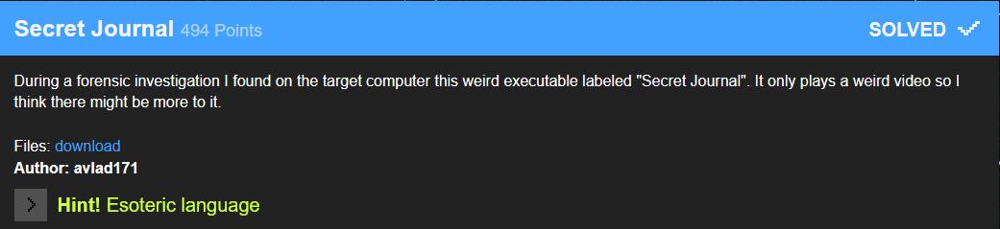
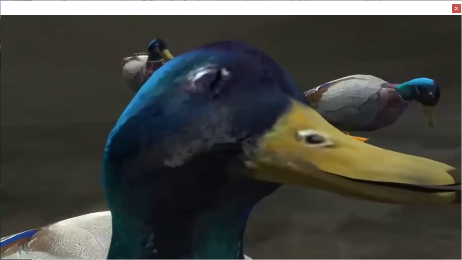
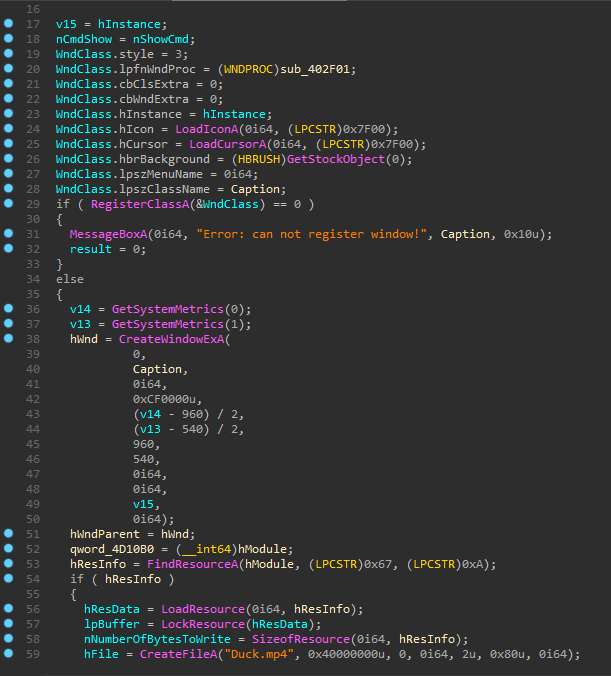
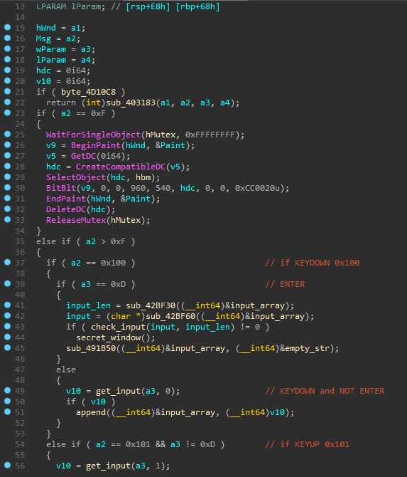
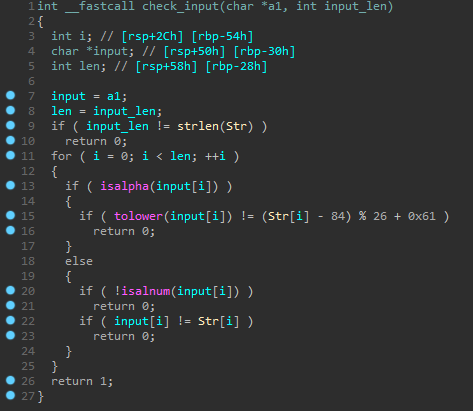
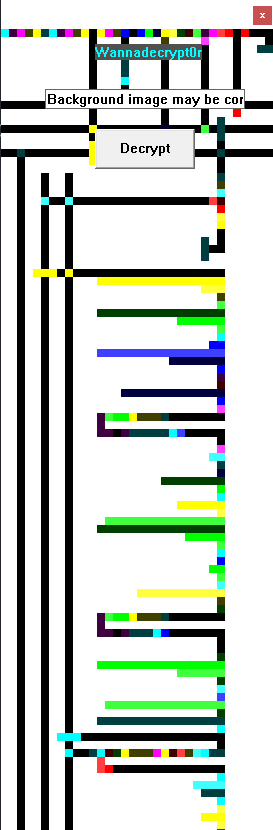
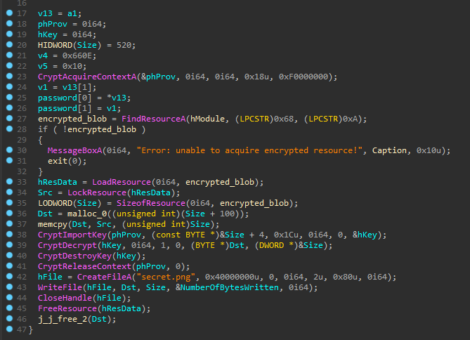

### Secret Journal



After launching the program, we are presented with a 2-minute funny video about duck eating microcontroller.



But there is no place to enter our password :(

Let's open it in IDA and see what's up

Winmain:



So, program loads duck.mp4 from resources, drops it to disk and starts thread that plays it.

If it has any other functionality, then it is in **sub_402f01**

**sub_402f01** - WindowProc callback function, an application-defined function that processes messages sent to a window.



As we can see, if we press **ENTER** every keystroke that we pressed before is being passed to **check_input** function and if it returns 1, the secret window will appear.

**check_input**  function code:



``` python
Str = "pnfgenirgryr0"
input = ""
for i in Str:
    input += chr((ord(i) - 84) % 26 + 0x61)
print(input)
```

``` python
>>> castraveteleq
```

The last character has to be number and be equal to Str[last], so the final password is **castravetele0**

After entering it, the new window appeared.



The winproc of this window is straight forward: if password is correct, then the secret.png will be decrypted.



And here comes the hint. This image is the program on **PIET** programming language. Passing it to online interpreter reaveals the password **parola_smechera0**. The secret.png gets decrypted and we get our flag :)
