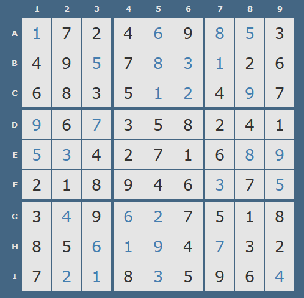

# Masochistic Sudoku (80 solves)

> Clam's tired of the ease and boredom of traditional sudoku. Having just one solution that can be determined via a simple online sudoku solver isn't good enough for him. So, he made masochistic sudoku! Since there are no hints, there are around 6*10^21 possible solutions but only one is actually accepted!
>
> Find it on the shell server at /problems/2020/masochistic_sudoku/.
>
> Author: aplet123

In this challenge we have to solve sudoku. But we don't know what numbers are present and the initial field looks like this:

```bash
+---+---+---+---+---+---+---+---+---+
|   |   |   |   |   |   |   |   |   |
+---+---+---+---+---+---+---+---+---+
|   |   |   |   |   |   |   |   |   |
+---+---+---+---+---+---+---+---+---+
|   |   |   |   |   |   |   |   |   |
+---+---+---+---+---+---+---+---+---+
|   |   |   |   |   |   |   |   |   |
+---+---+---+---+---+---+---+---+---+
|   |   |   |   |   |   |   |   |   |
+---+---+---+---+---+---+---+---+---+
|   |   |   |   |   |   |   |   |   |
+---+---+---+---+---+---+---+---+---+
|   |   |   |   |   |   |   |   |   |
+---+---+---+---+---+---+---+---+---+
|   |   |   |   |   |   |   |   |   |
+---+---+---+---+---+---+---+---+---+
|   |   |   |   |   |   |   |   |   |
+---+---+---+---+---+---+---+---+---+
```

If we fill the board with random numbers and hit **q**, the **check_flag** function will be called. The function checks few board positions for known values by calling **get_value** function with row_number, col_number and our entered number:

```c++
int get_value(int row, int col, int number)
{
  srand(13 * ((100 * row + 10 * col + number) ^ 0x2A) % 10067);
  return rand();
}
```

The returned value is compared with hardcoded number like this:

```asm
.text:000000000040124E                 push    rbp
.text:000000000040124F                 mov     rbp, rsp
.text:0000000000401252                 sub     rsp, 20h
.text:0000000000401256                 mov     eax, cs:board
.text:000000000040125C                 mov     edx, eax		; our value
.text:000000000040125E                 mov     esi, 0		; col
.text:0000000000401263                 mov     edi, 0		; row
.text:0000000000401268                 call    get_value
.text:000000000040126D                 cmp     eax, 68989C40h
.text:0000000000401272                 setz    al
.text:0000000000401275                 movzx   eax, al
.text:0000000000401278                 mov     edi, eax
.text:000000000040127A                 call    assert
.text:000000000040127F ; ---------------------------------------------------------------------------
.text:000000000040127F                 mov     eax, cs:dword_603170
.text:0000000000401285                 mov     edx, eax		; our value
.text:0000000000401287                 mov     esi, 4		; col
.text:000000000040128C                 mov     edi, 0		; row
.text:0000000000401291                 call    get_value
.text:0000000000401296                 cmp     eax, 4ED659A2h
.text:000000000040129B                 setz    al
.text:000000000040129E                 movzx   eax, al
.text:00000000004012A1                 mov     edi, eax
.text:00000000004012A3                 call    assert
.text:00000000004012A8 ; ---------------------------------------------------------------------------
.text:00000000004012A8                 mov     eax, cs:dword_603178
.text:00000000004012AE                 mov     edx, eax
.text:00000000004012B0                 mov     esi, 6
.text:00000000004012B5                 mov     edi, 0
.text:00000000004012BA                 call    get_value
.text:00000000004012BF                 cmp     eax, 7BB524E0h
.text:00000000004012C4                 setz    al
.text:00000000004012C7                 movzx   eax, al
.text:00000000004012CA                 mov     edi, eax
.text:00000000004012CC                 call    assert
.text:00000000004012D1 ; ---------------------------------------------------------------------------
.text:00000000004012D1                 mov     eax, cs:dword_60317C
.text:00000000004012D7                 mov     edx, eax
.text:00000000004012D9                 mov     esi, 7
.text:00000000004012DE                 mov     edi, 0
.text:00000000004012E3                 call    get_value
.text:00000000004012E8                 cmp     eax, 72B33E08h
.text:00000000004012ED                 setz    al
.text:00000000004012F0                 movzx   eax, al
.text:00000000004012F3                 mov     edi, eax
.text:00000000004012F5                 call    assert
.text:00000000004012FA ; ---------------------------------------------------------------------------
.text:00000000004012FA                 mov     eax, cs:dword_60318C
.text:0000000000401300                 mov     edx, eax
.text:0000000000401302                 mov     esi, 2
.text:0000000000401307                 mov     edi, 1
.text:000000000040130C                 call    get_value
.text:0000000000401311                 cmp     eax, 678DACB0h
```

Solution:

First of all, our task is to find this hardcoded numbers. I wrote simple program that does that:

```c++
#include <stdlib.h>
#include <time.h>
#include <stdio.h>
#include <map>
#include <list>
#include <set>
#include <iostream>
#include <algorithm>

std::list<std::list<int>> mapping = {
    {0, 0, 0x68989C40},
    {0, 4, 0x4ED659A2},
    {0, 6, 0x7BB524E0},  
    {0, 7, 0x72B33E08},
    {1, 2, 0x678DACB0},
    {1, 4, 0x16C64CB9},
    {1, 5, 0x776ABFDB},
    {1, 6, 0x49025844},
    {2, 4, 0x2496CFE6},
    {2, 5, 0x7F0845AE},
    {2, 7, 0x6E9739BA},
    {3, 0, 0x0C24786E},
    {3, 2, 0x7F1F38C9},
    {4, 0,  0x33AF080},
    {4, 1, 0x20AFEC13},
    {4, 7, 0x79A4CFE3},
    {4, 8, 0x14CAF991},
    {5, 6, 0x2A7CEA7F},
    {5, 8, 0x0BDB3DFA},
    {6, 1, 0x7732CF61},
    {6, 3,  0x2D070EB},
    {6, 4,  0x702A9DF},
    {7, 2, 0x741DEDC1},
    {7, 3, 0x1491F67C},
    {7, 4, 0x7DF52E16},
    {7, 6, 0x1A72C9C4},
    {8, 1, 0x7F53CB83},
    {8, 2, 0x551B572E},
    {8, 4, 0x134A8092},
    {8, 8, 0x56063756},
};


int brute(int row, int col, int find_val) {
    int c;
    for (int i = 0; i < 0xffffffff; i++) {
        srand(13 * ((100 * row + 10 * col + i) ^ 0x2A) % 10067);
        c = rand();
        if (c == find_val) {
            printf("FOUND KEY at [%d, %d] == %d\n", row + 1, col + 1, i);
            break;                
        }
    }
}


int main() {
    for (auto &elem : mapping) {
        std::list<int>::iterator it = elem.begin();
        auto v1 = *it;
        std::advance(it, 1);
        auto v2 = *it;
        std::advance(it, 1);
        auto v3 = *it;
        brute(v1, v2, v3);
    }

    return 0;
}
```

```bash
FOUND KEY at [1, 1] == 1
FOUND KEY at [1, 5] == 6
FOUND KEY at [1, 7] == 8
FOUND KEY at [1, 8] == 5
FOUND KEY at [2, 3] == 5
FOUND KEY at [2, 5] == 8
FOUND KEY at [2, 6] == 3
FOUND KEY at [2, 7] == 1
FOUND KEY at [3, 5] == 1
FOUND KEY at [3, 6] == 2
FOUND KEY at [3, 8] == 9
FOUND KEY at [4, 1] == 9
FOUND KEY at [4, 3] == 7
FOUND KEY at [5, 1] == 5
FOUND KEY at [5, 2] == 3
FOUND KEY at [5, 8] == 8
FOUND KEY at [5, 9] == 9
FOUND KEY at [6, 7] == 3
FOUND KEY at [6, 9] == 5
FOUND KEY at [7, 2] == 4
FOUND KEY at [7, 4] == 6
FOUND KEY at [7, 5] == 2
FOUND KEY at [8, 3] == 6
FOUND KEY at [8, 4] == 1
FOUND KEY at [8, 5] == 9
FOUND KEY at [8, 7] == 7
FOUND KEY at [9, 2] == 2
FOUND KEY at [9, 3] == 1
FOUND KEY at [9, 5] == 3
FOUND KEY at [9, 9] == 4
```

After that we go to online sudoku solver, enter this values and hit solve.

We fill the board with right values and get the flag :)

Here is my board:

 

```
actf{sud0ku_but_f0r_pe0ple_wh0_h4te_th3mselves}
```

