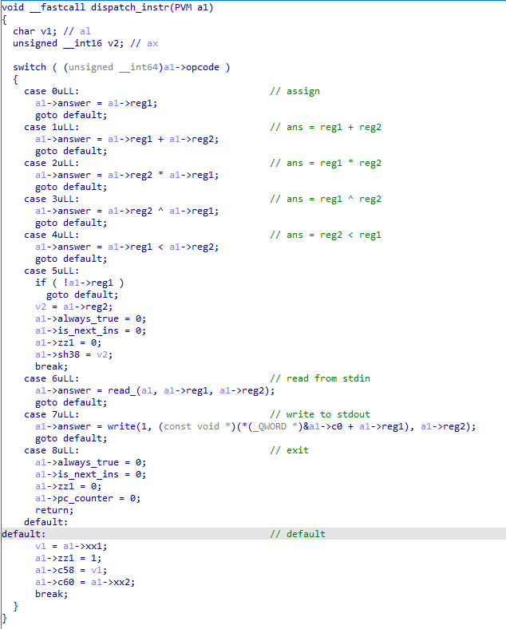
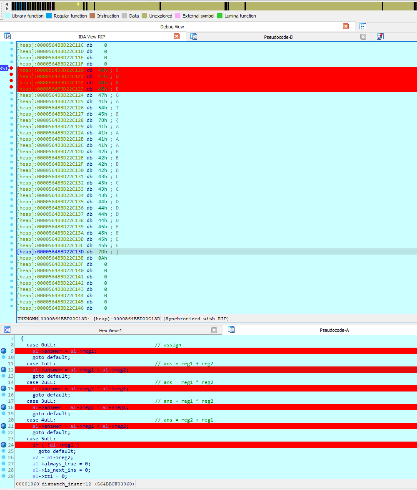
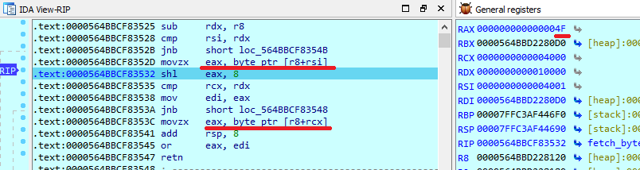
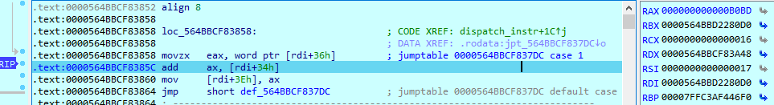

## HOW NOT TO SOLVE CHALLENGE MACHINE (333 points)

In this challenge we are given an elf file "simple machine" and "target". The challenge speaks for itself, we are dealing with virtual machine. The "target" is the vm state that it is processing.

First things first, we have to find the dispatch routine. The place, where opcodes gets executed. In this case it is at offset 0x17c0. After some reversing I made VM struct for better view.

```c
typedef struct vm {
    char c0;
    char c1;
    char c2;
    char c3;
    int dw4;
    int dw8;
    int dw12;
    int dw16;
    int dw20;
    int pc_counter; // 28
    unsigned short c30;
    unsigned short c32;
    unsigned short sh36;
    unsigned short sh38;
    unsigned char yyy0;
    unsigned char yyy1;
    unsigned char instr_offset;
    unsigned char yyy3;
    unsigned short sh1;
    unsigned short sh2;
    unsigned short c48;
    char always_true;
    char c51;
    unsigned char opcode;
    char xx1;
    unsigned short xx2;
    unsigned short reg1;  // 56
    unsigned short reg2;  // 58
    char is_next_ins;  // 56
    char c57;  // 57
    char c58;  // 58
    char c59;  // 59
    unsigned short c60;  // 60
    unsigned short answer;  // 62
    unsigned char zz1;
    unsigned char zz2;
} VM, *PVM;
```


And here is the dispatch routine with struct applied.



So, the way you should solve this challenge is by writing the disassembler for vm. Reverse the algorithm and get a flag. I was too lazy for that and made side channel attack on algo. 

As you can see from decompilation view we only have **3** math operations (multiplication, xor, addition). Based on that and the fact that **target** file is pretty small the algorithm should be very simple.

------

### Solution:

Place breakpoints on your input memory location and every case in switch case statement in dispatch routine.




Hit run and you'll break on memory access of your flag. Notice that program gets **2 bytes** at the time from your input.





Hit run and you break at dispatch routine "case 1" (which is addition). Notice that first argument is stored at **[rdi + 36h]** and the second one at **[rdi + 34h]**.



Following breakpoints we can see that if **[rdi + 36h]** (that holds special value) + **[rdi + 34h]** (that holds 2 bytes from our input) == 0x0000 then we pass, else we exit.

So... following this pattern on every 2 bytes from our input we get our algo.

```python
0x???? + 0xb0bd == 0
0x???? + 0xbabc == 0
0x???? + 0xbeb9 == 0
0x???? + 0xbaac == 0
0x???? + 0xcfce == 0
(0x63f7 ^ 0x????) + 0xf974 == 0
(0xa419 ^ 0x????) + 0x2b9d == 0
(0xec2b ^ 0x????) + 0x4caf == 0
(0x347d ^ 0x????) + 0xbee1 == 0
(0x5c87 ^ 0x????) + 0xfc0d == 0
(0xe589 ^ 0x????) + 0x6e48 == 0
(0x2e9b ^ 0x????) + 0xe03c == 0
(0x73ad ^ 0x????) + 0xd322 == 0
(0x94f7 ^ 0x????) + 0x1979 == 0
(0xbd19 ^ 0x????) + 0x36d6 == 0
(0xc72b ^ 0x????) + 0x40e8 == 0
```


```python
import binascii

magic_vals = [
    (0x63f7, 0xf974), 
    (0xa419, 0x2b9d), 
    (0xec2b, 0x4caf),
    (0x347d, 0xbee1), 
    (0x5c87, 0xfc0d), 
    (0xe589, 0x6e48), 
    (0x2e9b, 0xe03c), 
    (0x73ad, 0xd322), 
    (0x94f7, 0x1979), 
    (0xbd19, 0x36d6), 
    (0xc72b, 0x40e8)]

flag = b''

for item in magic_vals:
    for i in range(0xffff):
        x = (item[0] ^ i) + item[1]
        if x & 0xffff == 0:
            flag += binascii.unhexlify(hex(i)[2:])[::-1]

print(flag)
```

```bash
b'{ezpz_but_1t_1s_pr3t3x}'
```

