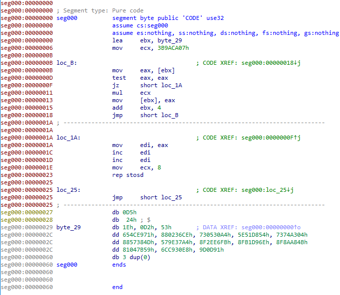

## Четвертое задание

Нам удалось получить дамп оперативной памяти по адресу 0. Там была какая-то программа, застрявшая в бесконечном цикле.

Из описания понятно, что программа закончила свое выполнение (застряла в бесконечном цикле)

Открыв в Иде и проанализировав код, становится видно, что программа записывает 38 байт по адресу 0x2 и прыгает туда после.

Теперь, чтобы не вписывать байты ручками, мы будем использовать [unicorn engine](unicorn-engine.org/) .

Unicorn engine - эмулятор процессора.

Код, который дампить в файл шеллкод:

```python

raw = open('Re4.bin', 'rb').read() # считываем весь файл

import binascii
from unicorn import *			   # импортируем библиотеку с эмулятором
from unicorn.x86_const import *

def hook_code(uc, address, size, user_data):
    if address == 0x01AA: # адрес, после которого идет прыжок по адресу 0х2
        print('end of decoding stage')
        shellcode = uc.mem_read(2, 0x63) # считываем из памяти по адресу 0х2 0х63 байт
        open('shellcode', 'wb').write(shellcode) # и сохраняем в файл
        
    if address == 0x27:
        uc.emu_stop()


uc = Uc(UC_ARCH_X86, UC_MODE_32)     # создаем эмулятор. В данном случае он 32-битный

base = 0
uc.mem_map(base, 0x1000)             # алоцируем 1КБ памяти для нашего кода
uc.mem_write(base, raw)              # записвыем в него код
uc.hook_add(UC_HOOK_CODE, hook_code) # добавляем хук, после которого эмулятор будет
                                     # останавливаться на каждой инструкции и вызывать
                                     # нашу функцию

try:
    uc.emu_start(base, base + len(raw))
except UcError as e:
    print(e)
    print(f'adr = {hex(uc.reg_read(UC_X86_REG_EIP))}')
```

Постарался полностью прокомментировать код, должно быть понятно.

после выполнения кода у нас появляется **shellcode** файл.

откроем его в Иде:



Видно, что программа берет 4 байта начиная с адреса 0x29, умножает их на **0x3B9ACA07** и записывает обратно.

После цикла, она затирает 32 байта, начиная с адреса 0х2 нулями и прыгает в бесконечный цикл.

### Решение

Для решение был написан код, который последовательно брутит 4 байта. Т.к. 4 байта - очень большое число, для скорости код был написан на ассемблере

```asm
section .text
global main
extern printf
; 
; nasm -f elf32 solve.asm && gcc -m 32 solve.o -o solve && ./solve
main:
    xor     eax, eax        ; init 
    lea     ebx, [flag]
    mov     ecx, 0x3B9ACA07
loop_0:
    mov     edx, [ebx]      ; test if we at the last dword
    test    edx, edx        ; if so, we exit
    je      print
    push    eax             ; save eax
    mul     ecx
    cmp     eax, [ebx]      ; check if eax * ecx == flag[i]
    je      success         ; if so we overwrite flag[i] with eax
    pop     eax
    inc     eax
    jmp     loop_0
success:
    pop     dword [ebx]     ; overwrite dword flag[i]
    lea     ebx,  [ebx + 4] ; inc ebx
    jmp     loop_0
print:
    push    flag
    push    format
    call    printf
    add     esp, 8
    ret

section .data

flag:
    dd 0xd21e24d5
    dd 0x4ce97153
    dd 0x0236ce65
    dd 0x0530a488
    dd 0x51d85473
    dd 0x74a3045e
    dd 0x57384d73
    dd 0x9e37a488
    dd 0x2ee6fb57
    dd 0xb1d96e8f
    dd 0x8aa84b8f
    dd 0x047b598f
    dd 0xc930e881
    dd 0x9d0d916c
    dd 0

format:
    db "%s\n", 0

```

После ~двух минут получаем флаг.