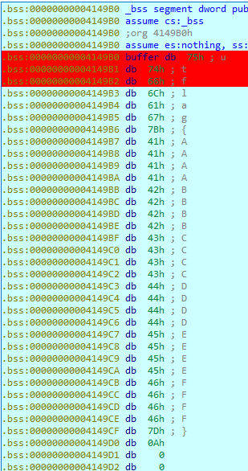

# Crack the Heart (56 solves)

Description:

> Convince your crush to go out with you. 
>
> Note: the flag is what you need to say to convince him/her to go out with you. 
>
> *by jitterbug*


We are given an Elf64 file. The binary is packed with custom **virtual machine** where register **rcx** holds "bytecode" and it has ~20 handlers.

```
.text:0000000000401000 start           proc near               ; DATA XREF: 
.text:0000000000401000                                         ; LOAD:0000000000400088↑o
.text:0000000000401000                 mov     rcx, offset virtual_machine
.text:000000000040100A                 mov     rdx, [rcx]
.text:000000000040100D                 lea     rcx, [rcx+8] ; inc pc
.text:0000000000401011                 jmp     rdx
.text:0000000000401011 start           endp
.text:0000000000401011
.text:0000000000401011 _text           ends
.text:0000000000401011
```

Solution:

We set hardware breakpoints on access on our entered flag and hit run.



We notice one access:

```
.data:0000000000402012 get_byte_from_rsi:  
.data:0000000000402012 mov     al, [rsi+r15] ; al holds one byte from our input
.data:0000000000402016 jmp     next_
```

Stepping a bit further reveals this code:

```
.data:00000000004020A7 xor     bl, al		; al - our input, bl - unknown value
.data:00000000004020A9 xor     r15, r15
.data:00000000004020AC mov     rdx, [rcx]
.data:00000000004020AF lea     rcx, [rcx+8]
.data:00000000004020B3 jmp     rdx
```

And at the end:

```
.data:0000000000402137 mov     al, [r10+r11]; al - unknown value
.data:000000000040213B sub     al, bl		; bl holds xored value
.data:000000000040213D jz      short next
.data:000000000040213F mov     ebp, 1		; ebp = 1 - fail
.data:0000000000402144 next:                                  
.data:0000000000402144 mov     rdx, [rcx]
.data:0000000000402147 lea     rcx, [rcx+8]
.data:000000000040214B jmp     rdx
```

If ebp is 1 we exit with badboy message.

Solution:

We set breakpoints on access on every char of our input and write down those unknown values.

I did it manually btw (teach me how to debug with idapython :( )

```python
from z3 import *
import sys

magics = [
    (0x04, 0x71),
    (0x91, 0xe5),
    (0x05, 0x63),
    (0x02, 0x6e),
    (0x06, 0x67),
    (0xcb, 0xac),
    (0x64, 0x1f),
    (0x61, 0x16),
    (0xd3, 0xbb),
    (0xcf, 0xae),
    (0x3b, 0x4f),
    (0x4b, 0x14),
    (0x67, 0x56),
    (0x4b, 0x2d),
    (0x11, 0x3f),
    (0xbd, 0x93),
    (0xb5, 0x9b),
    (0x29, 0x07),
    (0x3b, 0x52),
    (0x97, 0xc8),
    (0xcd, 0xa0),
    (0x56, 0x37),
    (0x70, 0x00),
    (0xc5, 0xb5),
    (0xf1, 0xc2),
    (0xc4, 0xa0),
    (0xa0, 0xff),
    (0xc0, 0xad),
    (0xf1, 0xa8),
    (0x8f, 0xd0),
    (0xda, 0xb7),
    (0xff, 0xcc),
    (0x7f, 0x12),
    (0x14, 0x24),
    (0x8b, 0xf9),
    (0x92, 0xeb),
    (0xce, 0x91),
    (0x87, 0xe9),
    (0xae, 0x9d),
    (0x10, 0x68),
    (0x99, 0xed),
    (0x16, 0x49),
    (0xe9, 0x9d),
    (0x96, 0xf9),
    (0xc4, 0x9b),
    (0xa6, 0xdf),
    (0xaf, 0x9f),
    (0xca, 0xbf),
    (0xdd, 0xaf),
    (0xd6, 0xa5),
    (0xfd, 0xd3),
    (0xee, 0xc0),
    (0x05, 0x2b),
    (0x5d, 0x73),
    (0xe6, 0x87),
    (0x55, 0x3d),
    (0x29, 0x48),
    (0x23, 0x4b),
    (0xda, 0xbb),
    (0xfd, 0x95),
    (0xca, 0xab),
    (0x8a, 0xa6),
    (0xa6, 0x86),
    (0xce, 0xa4),
    (0x71, 0x1a),
    (0xbc, 0xd6),
    (0xfc, 0x97),
    (0x4b, 0x65),
    (0x72, 0x5c),
    (0xc1, 0xef),
    (0x4a, 0x64),
    (0x29, 0x5c),
    (0xcb, 0xa5),
    (0x8d, 0xe1),
    (0x54, 0x31),
    (0x44, 0x37),
    (0x9a, 0xe9),
    (0x9b, 0xbb),
    (0x78, 0x43),
    (0x9f, 0xb6),
    (0x9e, 0xa1),
    (0xdf, 0xa2),
]

def main():
    s = Solver()

    flag_len = len(magics)

    def encode(magics, key):
        return (magics[0] - (key ^ magics[1]))

    for i in range(flag_len):
        globals()['b%d' % i] = BitVec('b%d' % i, 8)
        s.add(encode(magics[i], globals()['b%d' % i]) == 0)

    print(s.check())
    while s.check() == sat:
        model = s.model()
        block = []
        out = ''
        for i in range(flag_len):
            c = globals()['b%i' % i]
            out += chr(model[c].as_long())
            block.append(c != model[c])
        s.add(Or(block))
        print(out)

if __name__ == "__main__":
    sys.exit(main())

```


yields the flag

```
utflag{what_1f....i_mapp3d_mY_m3m0ry_n3xt_to_y0urs....ahahaha, jkjk....unless ;)?}
```

