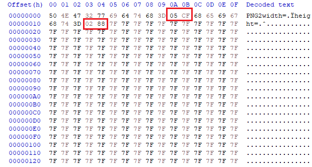
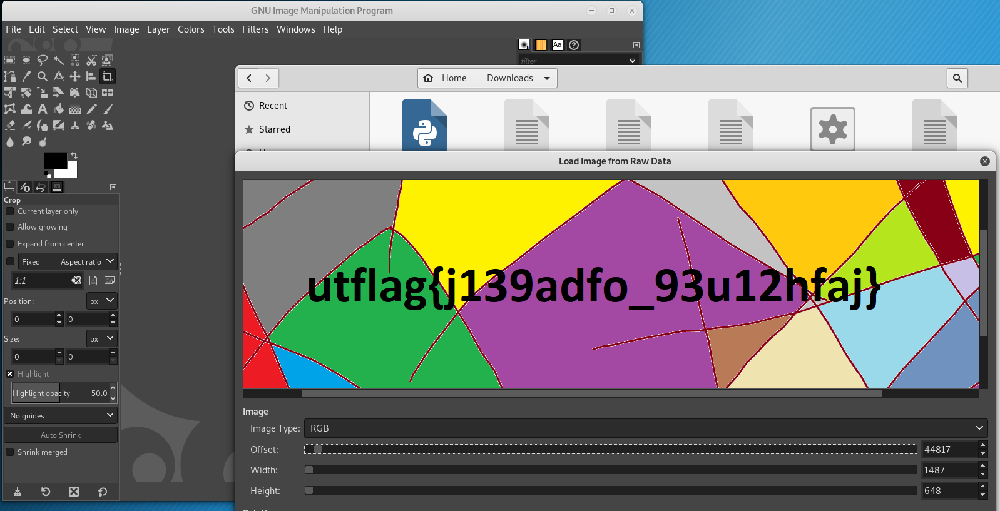

# .PNG2 (142 solves)

Description:

> In an effort to get rid of all of  the bloat in the .png format, I'm proud to announce .PNG2! 
>
> The first  pixel is #7F7F7F, can you get the rest of the image? 
>
> by bnuno

We are given a raw png image with custom headers.

As description says, the first pixel is #7F7F7F. So we can assume that everything b4 it is header.

Solution:

We take **width = 0x05cf** and **height = 0x0288** from header, open file as raw in **gimp**, set width and height and we instantly get the flag.

