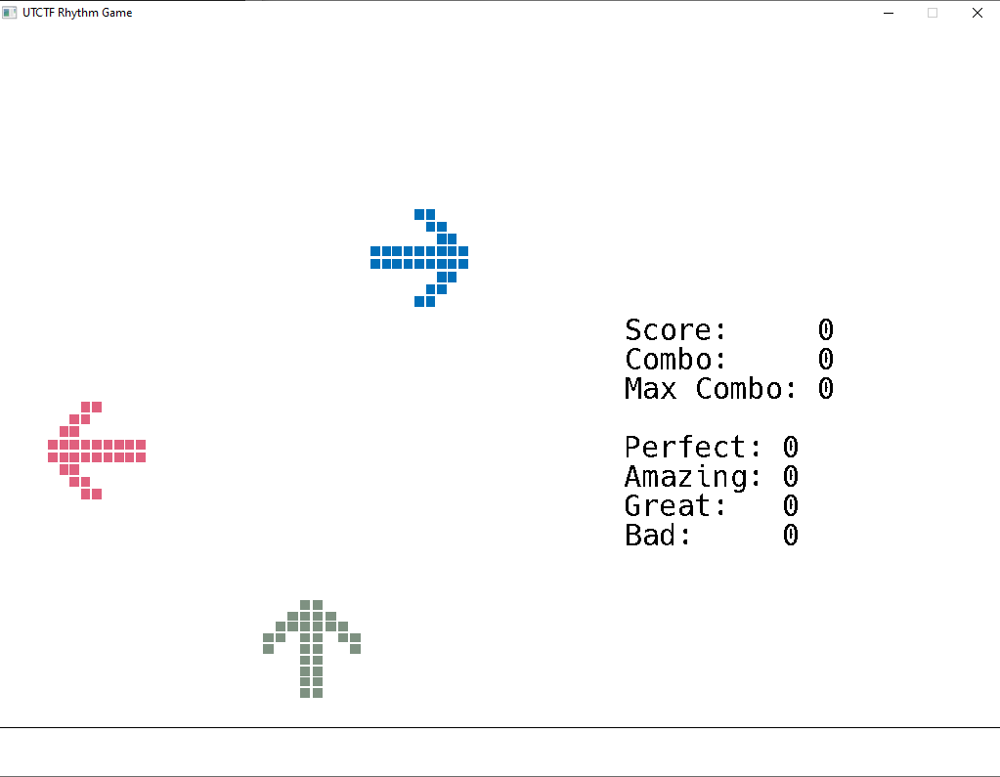
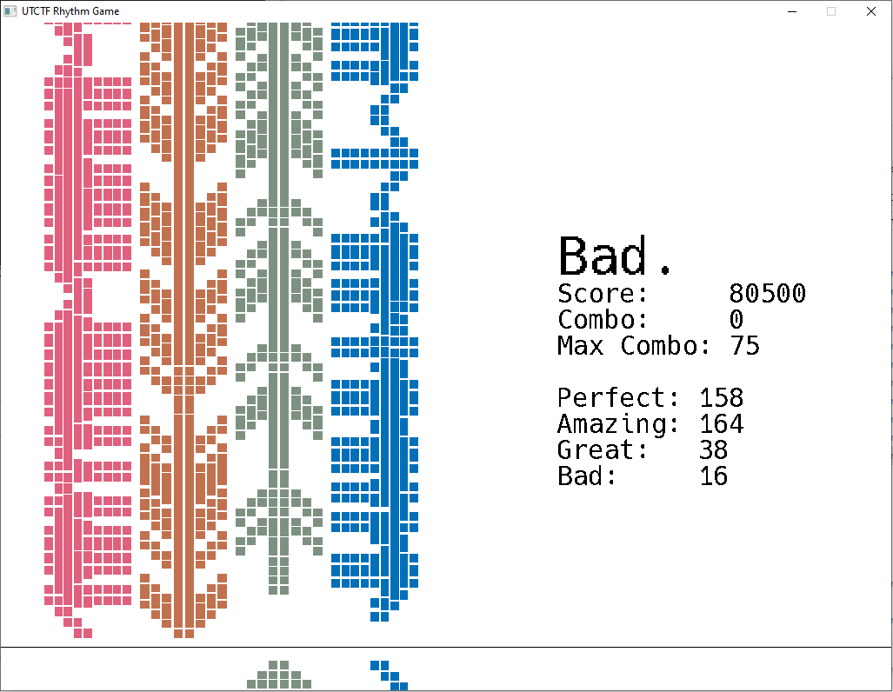
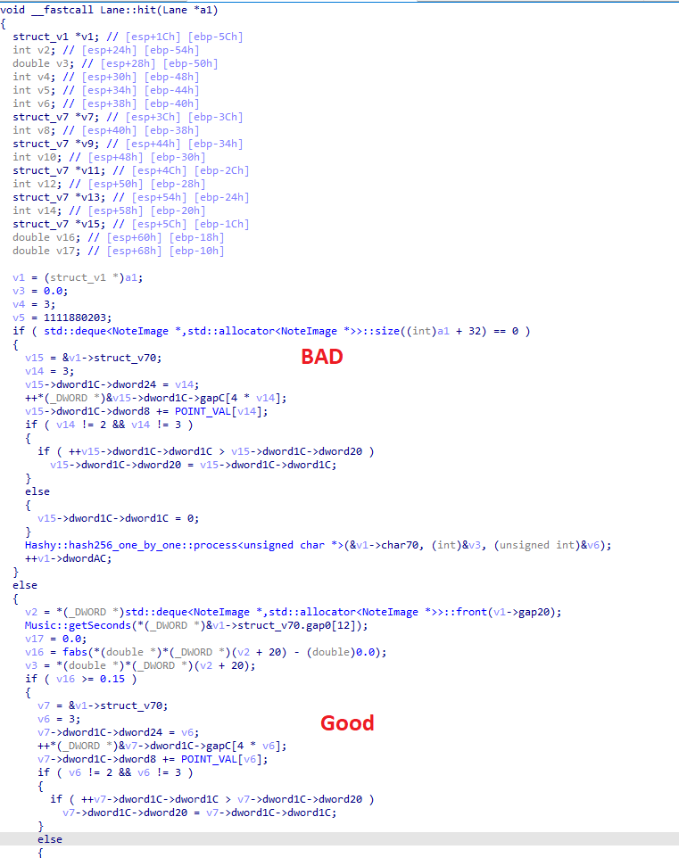
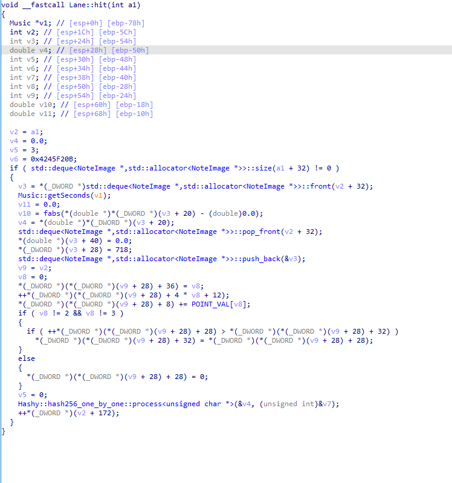
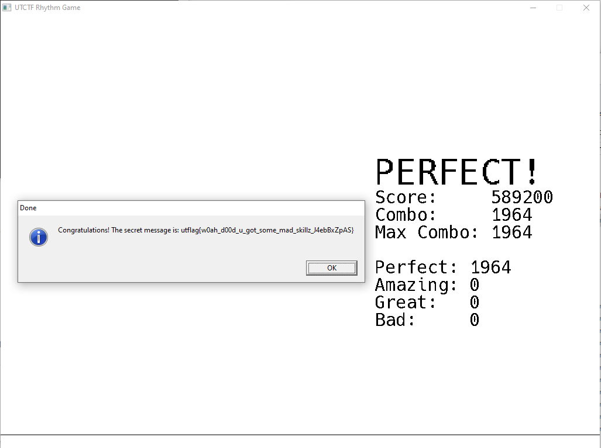

# Rhythm Game Vault (13 solves)

Description:

> Get all perfect to decrypt the flag.
>
>  *by gg*



We have to perfectly hit every arrow in order to get the flag.

The game was impossible to solve by hand because of this moment:



So we open **play.exe** in IDA and go to the **game loop** function.

```c++
int __usercall game_loop@<eax>(long double fst7_0@<st0>)
{
  exit = 0;
  v12 = 0;
  finished = Music::play((Timer **)music);
  while ( !exit )
  {
    while ( SDL_PollEvent((SDL_keysym *)&a1) != 0 )
    {
      if ( *(_DWORD *)&a1.type == 0x100 )
      {
        exit = 1;
      }
      else if ( *(_DWORD *)&a1.type == 0x300 )
      {
        v11 = (Lane *)-1;
        if ( v7 == 'w' )
          goto LABEL_40;
        if ( v7 <= 'w' )
        {
          if ( v7 == 'd' )
            goto LABEL_22;
          if ( v7 != 's' )
          {
            if ( v7 != 'a' )
              goto LABEL_23;
LABEL_21:
            v11 = 0;
            goto LABEL_23;
          }
LABEL_20:
          v11 = (Lane *)1;
          goto LABEL_23;
        }
        if ( v7 == 0x40000050 )
          goto LABEL_21;
        if ( v7 <= 0x40000050 )
        {
          if ( v7 != 0x4000004F )
            goto LABEL_23;
LABEL_22:
          v11 = (Lane *)3;
          goto LABEL_23;
        }
        if ( v7 == 0x40000051 )
          goto LABEL_20;
        if ( v7 == 0x40000052 )
LABEL_40:
          v11 = (Lane *)2;
LABEL_23:
        if ( v11 != (Lane *)-1 )
        {
          v2 = (Lane **)std::vector<Lane *,std::allocator<Lane *>>::operator[](&lanes, (int)v11);
          Lane::hit(*v2);
        }
      }
    }
    SDL_SetRenderDrawColor((int)gRenderer);
    SDL_RenderClear((int)gRenderer, 255, 255, 255, 255);
    v10 = &lanes;
    v5 = std::vector<Lane *,std::allocator<Lane *>>::begin(&lanes);
    v4 = std::vector<Lane *,std::allocator<Lane *>>::end(v10);
    while ( (unsigned __int8)__gnu_cxx::operator!=<Lane **,std::vector<Lane *,std::allocator<Lane *>>>(&v5, &v4) )
    {
      v9 = *(_DWORD *)__gnu_cxx::__normal_iterator<Lane **,std::vector<Lane *,std::allocator<Lane *>>>::operator*(&v5);
      Lane::updateViewable(v9, fst7_0);
      __gnu_cxx::__normal_iterator<Lane **,std::vector<Lane *,std::allocator<Lane *>>>::operator++(&v5);
    }
    (**(void (__fastcall ***)(int))mainScene)(mainScene);
    SDL_RenderPresent((int)gRenderer);
    finished = v12 != 1 && (unsigned __int8)::finished();
    if ( (_BYTE)finished )
    {
      if ( !allPerfect() )
      {
        finished = SDL_ShowSimpleMessageBox(64, "Done", "Get all perfect to decrypt the secret!", gWindow);
      }
      else
      {
        std::vector<Lane *,std::allocator<Lane *>>::vector(&lanes);
        v3 = showSecret((int)gWindow, (int)&v8, secret_path) ^ 1;
        finished = std::vector<Lane *,std::allocator<Lane *>>::~vector(&v8);
        if ( (_BYTE)v3 )
          finished = SDL_ShowSimpleMessageBox(
                       64,
                       "Done",
                       "There seems to be no secret attached to this song, or the secret was corrupted. ",
                       gWindow);
      }
      v12 = 1;
    }
  }
  return finished;
}
```


We are interested in **Lane::hit** function. Every keystroke that we press goes to this function. 



I didn't actually reverse this function, just made some educational guesses and tests.

In game, there are 4 possible hits **Perfect, Amazing, Good, Bad**

In this function, there are 4 if else statements. 

After some testing we find which if else statement sets the **Perfect** hit. So we just nop every other hit from this function and leave only the **Perfect** one.

After some patching the function now looks like this:




So, every time we press keystroke and if we hit perfect, we register it, otherwise we just return.

So now if we open the game, hold **W A S D** at the same time for the whole song, we get the flag!



