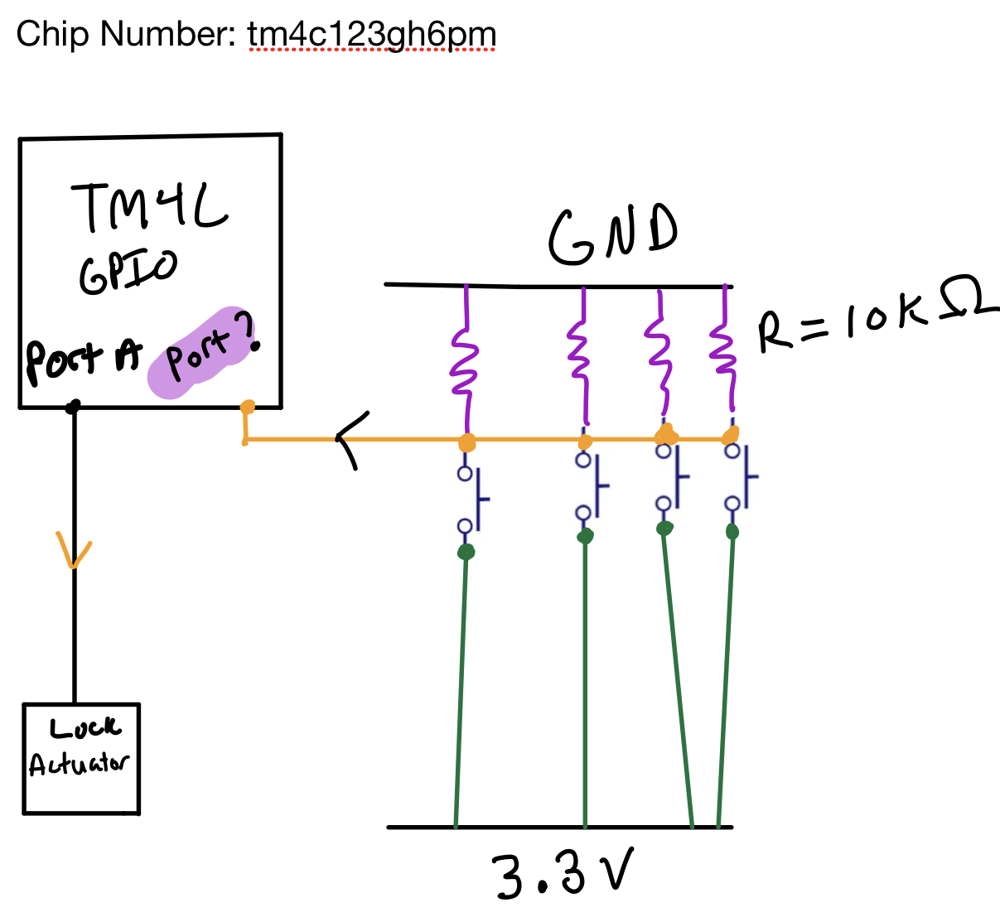
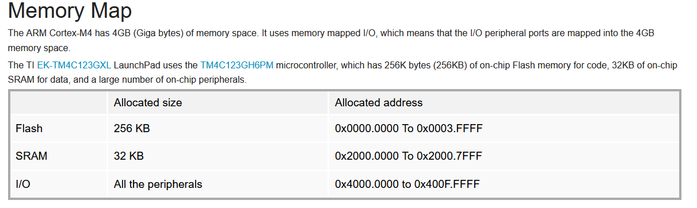

# The Securest Vault ™ (9 solves)

Description:

> You've been contracted to check an IoT vault for a potential backdoor. 
>
> Your goal is to figure out the  sequence that unlocks the vault and use it to create the flag.  Unfortunately, you were unable to acquire the hardware and only have a  schematic drawn by the vault company's intern, a firmware dump and the  model number of the microcontroller. 
>
> The flag has the following format: utflag{P<PORT_LETTER><PORT_NUMBER>} , ex: utflag{PD0,PD2} 
>
> by Dan




This was my first firmware reversing, so I think I got lucky with guesses.

First thing you have to do is create a segment for I/O peripherals:



After that you go [here](http://users.ece.utexas.edu/~valvano/Volume1/tm4c123gh6pm.h) and rename every memory access with its corresponding name.

After that we can notice some interesting function:

```c++
void __fastcall enable_Ports(_DWORD *a1, int a2)
{
  _DWORD *v2; // r5
  int v3; // r4

  v2 = a1;
  v3 = a2;
  disable_interupts();
  sub_448(4);
  sub_53C(v3);
  SYSCTL_RCGCGPIO_R |= 0x11u;                   // enable clock
  GPIO_PORTE_DIR_R = 0;                         // set Port E0-E5 as inputs
  GPIO_PORTE_DEN_R |= 15u;                      // enable Port E0-E3 pins
  GPIO_PORTA_DIR_R &= 0xFFFFFFFE;               // set Port A0 as output
  PORTA_DEN_R |= 1u;                            // enable Port A0
  *v2 = v3;
  NVIC_ST_CURRENT_R = 0;
  enable_interupts();
}
```

After reading [this](http://users.ece.utexas.edu/~valvano/Volume1/E-Book/C6_MicrocontrollerPorts.htm) paper, I finally understood how gpio worked. The inputs are being send to Port E0-E3 and output for lock auth is Port A0.

If we look at the function list, we can find this big one:

```c++
void big_one()
{
  char input; // r4
  int v1; // r0

  if ( sub_78C((int)GPIO_PCTL_PB7_SSI2TX) <= 14 ) // loop variable?
  {
    input = GPIO_PORTE_DATA_R & 0xF; // data gets read here from pins 0-3
    if ( sub_756((int)GPIO_PCTL_PB7_SSI2TX) )
    {
      if ( sub_756((int)GPIO_PCTL_PB7_SSI2TX) )
      {
        v1 = sub_770((int)GPIO_PCTL_PB7_SSI2TX);
        if ( v1 )
        {
          if ( v1 == 1 )
          {
            if ( !(input & 2) )
            {
              sub_784((int)GPIO_PCTL_PB7_SSI2TX);
              sub_6EC(GPIO_PCTL_PB7_SSI2TX);
            }
          }
...
...
...
```

After that, I did some guesses.

We have to find the sequence that opens the lock. The only place, where Port E0-E3 gets read is in this **big_one** function. We can also notice **0x14** if some value is less then 0x14, we store it somewhere, else we call "compare" function.

```c++
void  compare(unsigned __int8 *a1)
{
  unsigned __int8 *v1; // r4
  int i; // r5
  int v3; // r0

  v1 = a1;
  disable_interupts();
  for ( i = 0; ; ++i )
  {
    if ( i >= 15 )
    {
      enable_portA();
      return;
    }
    if ( v1[i + 2] != v1[i + 18] )	// cmp 
      break;
  }
  v3 = 0;
  v1[1] = 0;
  while ( v3 < 15 )
    v1[v3++ + 2] = 0;
  NVIC_ST_CURRENT_R = 0;
  enable_interupts();
}
```

So, we can assume that password length is 0x14, after looking at the **start** function, we can find this interesting place:

```c++
void __fastcall sub_694(_BYTE *result)
{
  int v1; // r1

  v1 = 0;
  result[1] = 0;
  result[17] = 0;
  while ( v1 < 15 )
    result[v1++ + 2] = 0;
  result[18] = 0;
  result[19] = 2;
  result[20] = 3;
  result[21] = 0;
  result[22] = 1;
  result[23] = 3;
  result[24] = 2;
  result[25] = 1;
  result[26] = 0;
  result[27] = 2;
  result[28] = 3;
  result[29] = 0;
  result[30] = 2;
  result[31] = 1;
  result[32] = 0;
}
```

32-18 = 14 bytes gets filled with some initial values, I guessed it was the right sequence and was right :)

the flag is:

```
utflag{PE0,PE2,PE3,PE0,PE1,PE3,PE2,PE1,PE0,PE2,PE3,PE0,PE2,PE1,PE0}
```

